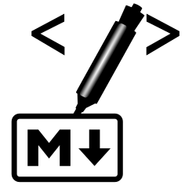

# Marker 

Marker is an Erlang Markdown library, including parser and renderer.
The project has been created during the [SpawnFest 2021](https://spawnfest.org/)
hackathon and consists of two parts:

* `marker` Erlang library in the `marker/` directory exporting functions
for parsing and rendering
* web demo in `marker-web/` directory presenting the way Markdown documents
are parsed (for e.g. debugging) and rendered into HTML.

## How does it work?

The library, `marker` is build with a focus on the [CommonMark specification](https://commonmark.org/)
and uses hand written parser inspired by the CommonMark's [parsing strategy](https://spec.commonmark.org/0.30/#appendix-a-parsing-strategy) (because of time constraints it doesn't follow it fully).

The website uses LiveView to pass input text to the parser and renderer,
gets resulting HTML and displays it immediately as a part of the page.

### Parsing

The parsing process consists of two parts/steps:
1. During the first phase the input text is processed line-by-line and the overall
structure of that is created, the tree of blocks (see specification for details).
1. During the second phase, the parser works on the leaves of the tree of blocks,
so called inline elements - paragraphs and headings. In this step the parser
interprets text formatting and links and after that the document tree is ready
for rendering.

### Rendering

Rendering process is much easier than parsing as it's only generates strings
surrounded by proper HTML tags.

Renderer takes a document tree generated in the parsing phase, walks through that
and generated string representation of the children using the order stated
by parser.

### Supported elements

Currenly `marker` (to some buggy extend) supports these Markdown elements:

* italics
* bolds
* headings
* blockquotes
* unordered lists
* horizontal rules
* inline code excerpts
* code blocks
* ordered lists

TBD:
* links
* images

## Authors

The project has been created by the **BKLH** team of two:
* Burak [@andreyuhai](https://github.com/andreyuhai)
* Łukasz [@hryniuk](https://github.com/hryniuk)
